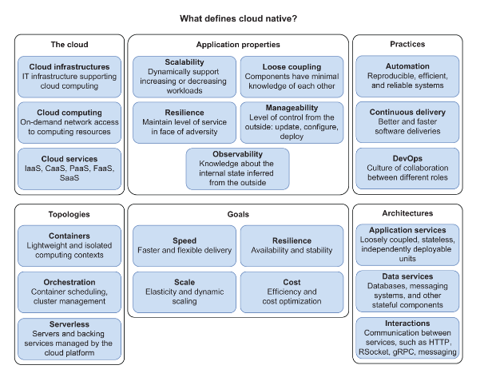

# What is Cloud ?
Cloud is an IT infrastructure that support delivery of computing resources to the consumers according to the cloud computing model.

The National Institute of Standards and Technology (NIST) defines cloud computing as follows
*Cloud computing is a model for enabling ubiquitous, convenient, on-demand network access to a shared pool of configurable computing resources (e.g., networks, servers, storage, applications, and services) that can be rapidly provisioned and released with minimal management effort or service provider interaction.*

Elasticity is the main characterics of cloud . ondemand scale in and out.
*Elasticity is the degree to which a system is able to adapt to workload changes by provisioning and de-provisioning resources in an autonomic manner, such that at each point in time the available resources match the current demand as closely as possible*

# Cloud Deployment Models 
There is no restriction on where cloud infra should be or who will manage.
Below 3 cloud deployment models for delivering cloud services -
* private cloud - infra provisioned to be used by one organization because of security compliance , law ( GDPR) - mostly banking & healthcare.
* public cloud - infra managed by cloud provider. aws , azure
* hybrid cloud - public + private
* multi cloud - multiple public cloud OR multiple managed service (saas)
# Cloud Service models 
What each deployment model are providing.

# What is cloud native?

*Cloud native technologies empower organizations to build and run scalable applications in modern, dynamic environments such as public, private, and hybrid clouds. Containers, service meshes, microservices, immutable infrastructure, and declarative APIs exemplify this approach.*

*These techniques enable loosely coupled systems that are resilient, manageable, and observable. Combined with robust automation, they allow engineers to make high-impact changes frequently and predictably with minimal toil.*

## Three Ps of Cloud Native - 
* Platform -  CN apps run on a dynamic distributed environment - cloud ( private, public , hybrid) 
* Properties - CN app are deisgned for scalable, loosely coupled , resilient , managable and observable.
* Practice - practices around cn apps - devops, continuous delivery , and automation

# Cloud native app properties 
 ## Scalability
 HS and VS scability is prerequisite of elasticity.
 ## Loosely coupling
 decompose system into modules ( modularizations) - loose coupling , high cohesive
  Parnas identified three benefits of modularization:6
  
  **Managerial**—Since each module is loosely coupled, the team responsible for it should not need to spend much time coordinating and communicating with other teams.
  
  **Product flexibility**—The overall system should be flexible since each module is evolved independently of the others.
  
  **Comprehensibility**—People should be able to understand and work with a module without having to study the whole system.
  
   **Watch out for distributed monolith/modular monolith - tightly coupled , non-cohesive microservice because of lack of proper modularization.**
 ## Resilience
   *Resilience is “the capability of a hardware-software network to provide and maintain an acceptable level of service in the face of faults and challenges to normal operation*
    **Fault**—A fault is a defect that produces an incorrect internal state either in the software or the infrastructure. For example, a method call returns a null value, even if its specification mandates that a non-null value is returned.
    
    **Error**—An error is a discrepancy between the expected behavior of a system and the actual one. For example, due to the preceding fault, a NullPointerException is thrown.
    
    **Failure**—When a fault is triggered and results in an error, a failure might occur, making the system unresponsive and unable to behave according to its specifications. For example, if the NullPointerException is not caught, the error provokes a failure: the system responds to any request with a 500 response.
    
    NOTE: Fault becomes error which will turned out failure . Need to build fault-tolerant system,elf-repairing or self-healing system -  An essential part of resilience is ensuring that a failure will not cascade to other components of the system but stay isolated while it gets fixed. Cloud can provide that.
    Patterns like circuit breakers, retries, timeouts, and rate limiters will help.

  ## Observability 
  Control theory - observability is a measure of how well you can infer its internal state from its external outputs.
 
